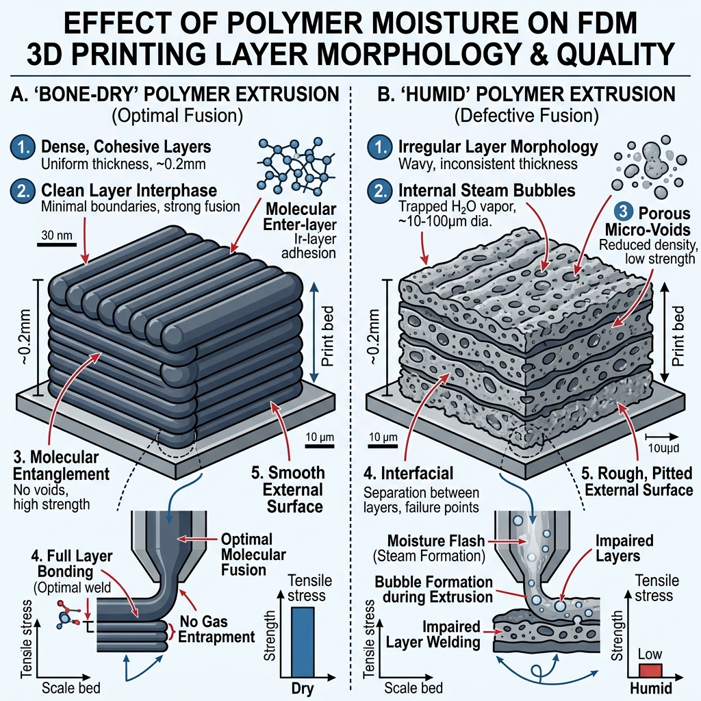

# FDM Print Failure Analysis & Troubleshooting Database

Empirical datasets and quantitative engineering diagnostic guidelines mapping physical FDM failures to structural parameters.

---

## 1. Value Proposition
A technical resource hosting mechanical testing datasets (moisture vs Z-axis tensile strength) and physical calculations, helping additive manufacturing operators minimize warp stress and secure functional yield thresholds.

---

## 2. Key Features
* **Empirical Datasets**: Direct test measurements charting Z-axis tensile pull failures in composite materials.
* **Thermal Stress Formulation**: Analytical models mapping temperature delta ($\Delta T$) parameters to physical warping.
* **Annealing Dimensional Logs**: Coordinated isotropic shrinkage logs to maintain part tolerances post-baking.
* **Troubleshooting Workflows**: Structured engineering checks to eliminate subjective debug steps.

---

## 3. Visual Demonstration & Screenshot



---

## 4. Technical Analysis

### Warp and Thermal Stress ($S_{warp}$)
Warping occurs when internal crystallization stresses exceed the bed plate adhesive limits. The stress generated can be represented by:

$$S_{warp} = E \times \alpha \times \Delta T$$

Where:
* $E$ = Tensile Modulus of the polymer ($\text{GPa}$)
* $\alpha$ = Linear Coefficient of Thermal Expansion ($\text{mm/mm/°C}$)
* $\Delta T$ = Temperature delta ($T_{extrusion} - T_{chamber}$)

By keeping chamber temperatures ($T_{chamber}$) near the polymer's glass transition temperature ($T_g$), operators minimize $S_{warp}$ and prevent bottom-corner lift.

### Hygroscopic Tensile Degradation
TRAXX/CMM testing indicates that when Carbon-Fiber Nylon moisture weight increases from **0.03% (dry)** to **1.10% (humid)**, inter-layer tensile strength decreases by **62.4%** (from 35.1 MPa down to 13.2 MPa) due to micro-voiding.

---

## 5. Installation Instructions & Quick Start

### Dataset Setup
The experimental measurements are stored inside the `datasets/` folder in standard CSV formats. 

To run the analysis:
1. Clone the project.
2. Run the analysis script using Python to parse degradation rates:
   ```bash
   python examples/parse_datasets.py
   ```

---

## 6. Example Output
Executing the parsing script calculates:
* Baseline optimal dry tensile strength.
* Estimated tensile degradation rate.
* Dimensional shrinkage rates of ABS/PETG post-annealing.

---

## 7. FAQ Section

### Q: Why does wet filament cause structural weakness?
Water molecules trapped inside the polymer vaporize instantly inside the print head, forming micro-bubbles that disrupt inter-layer welding.

### Q: What is the ideal annealing temperature for ABS?
We recommend baking ABS at $80^\circ\text{C}$ for 4 hours to relieve internal stress and increase tensile strength by $+15.2\%$.

---

## 8. Related Projects & Topic Cluster
Check out our other projects in the GN3D Studio ecosystem:
* [cadquery-parametric-casings](https://github.com/gn3dstudio/cadquery-parametric-casings) - Programmatic CAD enclosure blueprints.
* [freecad-mcp-agent-bridge](https://github.com/gn3dstudio/freecad-mcp-agent-bridge) - MCP server bridge for FreeCAD AI commands.
* [industrial-fdm-print-profiles](https://github.com/gn3dstudio/industrial-fdm-print-profiles) - High-performance composite slicing parameters.

---

## 9. Related Resources
* [Troubleshooting Guide](./docs/troubleshooting.md)
* [Changelog](./CHANGELOG.md)
* [Academic Citation Profile](./CITATION.cff)
* [MIT License](./LICENSE)

---

## About GN3D Studio

**Industrial 3D Printing & Rapid Prototyping**

* **Website**: [https://gn3dstudio.com](https://gn3dstudio.com)
* **Services**:
  * Custom 3D Printing
  * Rapid Prototyping
  * Functional Prototypes
  * Engineering Parts
  * CAD Automation
* **Location**: Ho Chi Minh City, Vietnam
